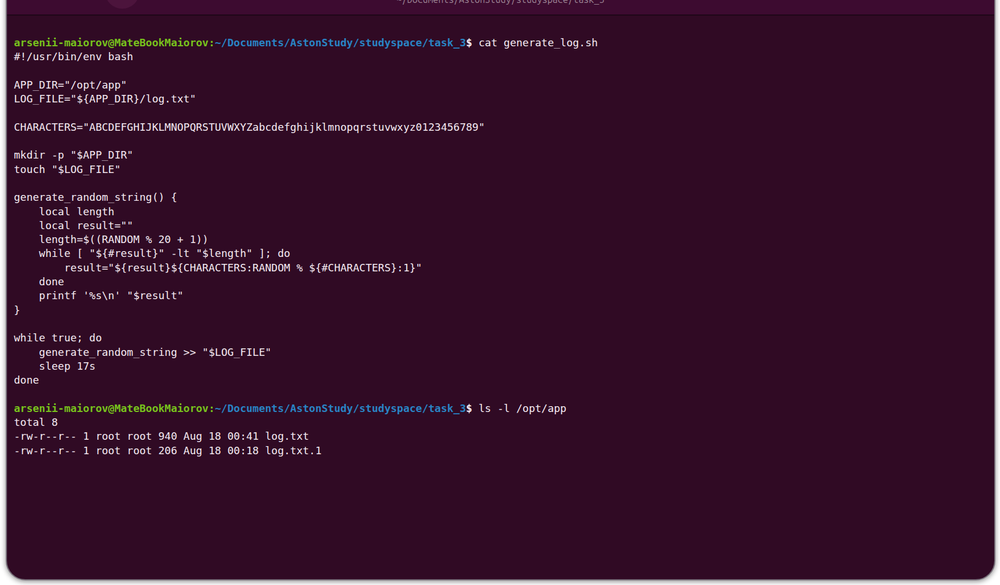
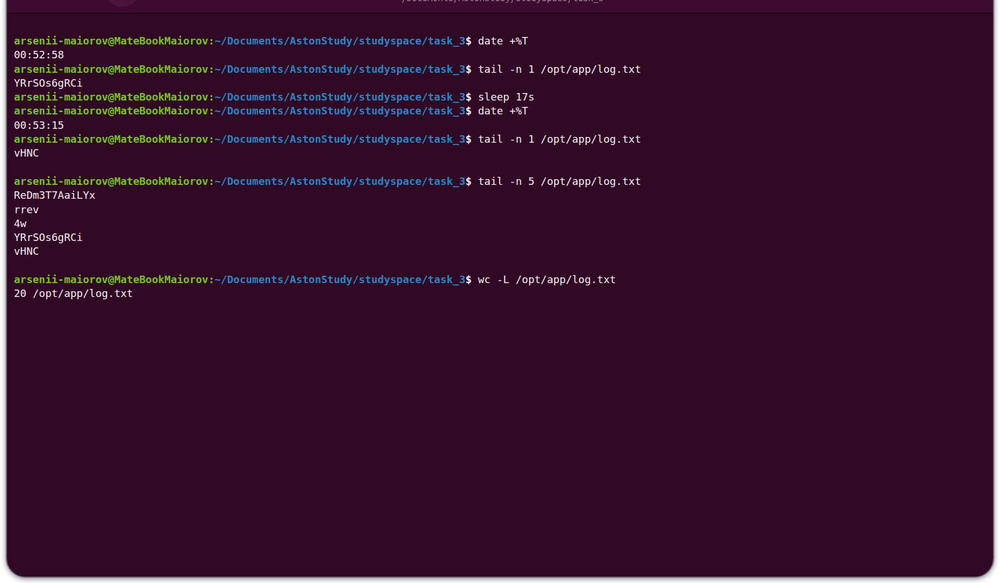
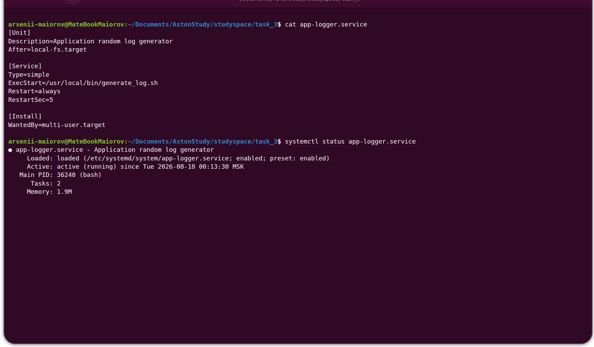
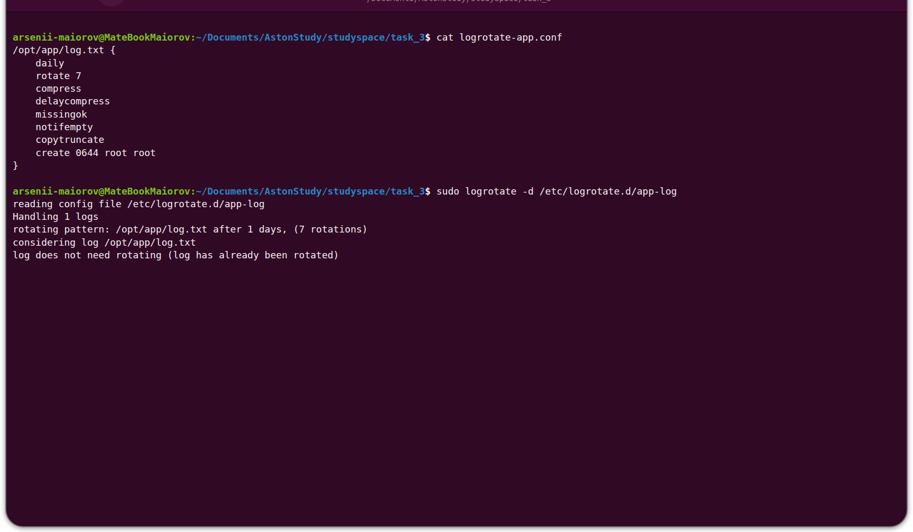

# Домашнее задание 3

Скрипт `generate_log.sh` создаёт `/opt/app/log.txt` и записывает в него случайную строку раз в 17 секунд.

## Ручной запуск

```bash
sudo ./generate_log.sh
```

Скрипт работает в терминале. Для остановки нажмите `Ctrl+C`. `sudo` нужен, так как журнал находится в `/opt`.

## Автозапуск после перезагрузки

```bash
sudo cp generate_log.sh /usr/local/bin/generate_log.sh
sudo cp app-logger.service /etc/systemd/system/app-logger.service
sudo cp logrotate-app.conf /etc/logrotate.d/app-log
sudo systemctl daemon-reload
sudo systemctl enable app-logger.service
```

## Ход выполнения работы

### 1. Создание папки и файла

В скрипте есть `mkdir -p` и `touch`. Команда `ls` показывает созданный файл `/opt/app/log.txt`.



### 2. Запись случайных строк каждые 17 секунд

В коде есть `sleep 17s`: `s` означает секунды. На скриншоте строка в логе меняется между `00:52:58` и `00:53:15`. `wc -L` показывает максимальную длину строки — 20 символов. `tail` выводит строки по одной, то есть с новой строки.



### 3. Автозапуск

`systemctl status` показывает, что служба включена (`enabled`) и запущена (`active`).



### 4. Ротация логов

В конфигурации включены ежедневная ротация, хранение 7 копий, сжатие и `copytruncate`. Команда `logrotate -d` проверяет конфигурацию без изменения файлов.


